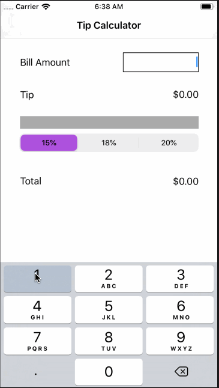

# Pre-work - *Tip Calculator*

Submitted by: **Kimly Tor**

Time spent: **6** hours spent in total

## User Stories

The following **required** functionality is complete:

* [X] User can enter a bill amount, choose a tip percentage, and see the tip and total values.

The following **optional** features are implemented:
* [ ] Settings page to change the default tip percentage.
* [ ] UI animations
* [ ] Remembering the bill amount across app restarts (if <10mins)
* [ ] Using locale-specific currency and currency thousands separators.
* [ ] Making sure the keyboard is always visible and the bill amount is always the first responder. This way the user doesn't have to tap anywhere to use this app. Just launch the app and start typing.

The following **additional** features are implemented:

- [ ] List anything else that you can get done to improve the app functionality!

## Video Walkthrough 

Here's a walkthrough of implemented user stories:

GIF created with [LiceCap](http://www.cockos.com/licecap/).

## Notes
Describe any challenges encountered while building the app.

1. Different versions of Xcode were used. I used Xcode 11 but the video walkthrough used Xcode 10 or lower which resulted in  confusion of work flow at first. However, I was able to find tips on how to create Main.storyboard and how to locate features such as assistant and object library on Xcode 11.

2. Debugging the code was challenging. Without the video walkthrough I wouldn't know where to start.

3. I commit without push from the local machine so when I pull from Github, all the codes were overridden with the un-updated files. I had to rewrite the code from scratch. I learned a lesson to keep extra backup files.

## License

    Copyright [2019] [Kimly Tor]

    Licensed under the Apache License, Version 2.0 (the "License");
    you may not use this file except in compliance with the License.
    You may obtain a copy of the License at

        http://www.apache.org/licenses/LICENSE-2.0

    Unless required by applicable law or agreed to in writing, software
    distributed under the License is distributed on an "AS IS" BASIS,
    WITHOUT WARRANTIES OR CONDITIONS OF ANY KIND, either express or implied.
    See the License for the specific language governing permissions and
    limitations under the License.
